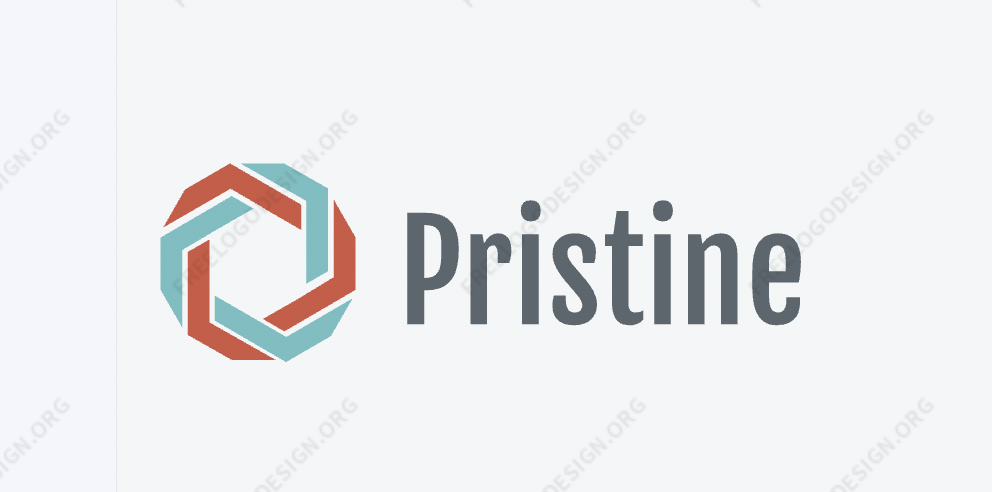
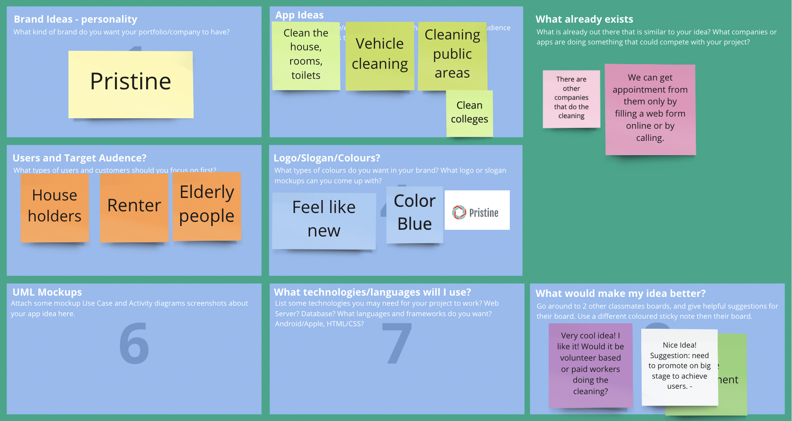

# Pristine

As our lives are becoming busier and busier, we are getting less time to maintain our homes. To go in person or call a cleaning service agency every time to schedule appointments will increase the turnaround time. Also, the people from the agency have to visit the place to be cleaned and give a quotation. This project aims to reduce the turnaround time and make it easy to schedule or modify an appointment with the help of a mobile application. [See diagram 1 and 2]. Having a mobile application to schedule appointments easily will reduce the overall time. The customer can send photos or images of the house or place to be cleaned through the application. The application will be designed to run on an Android device.

